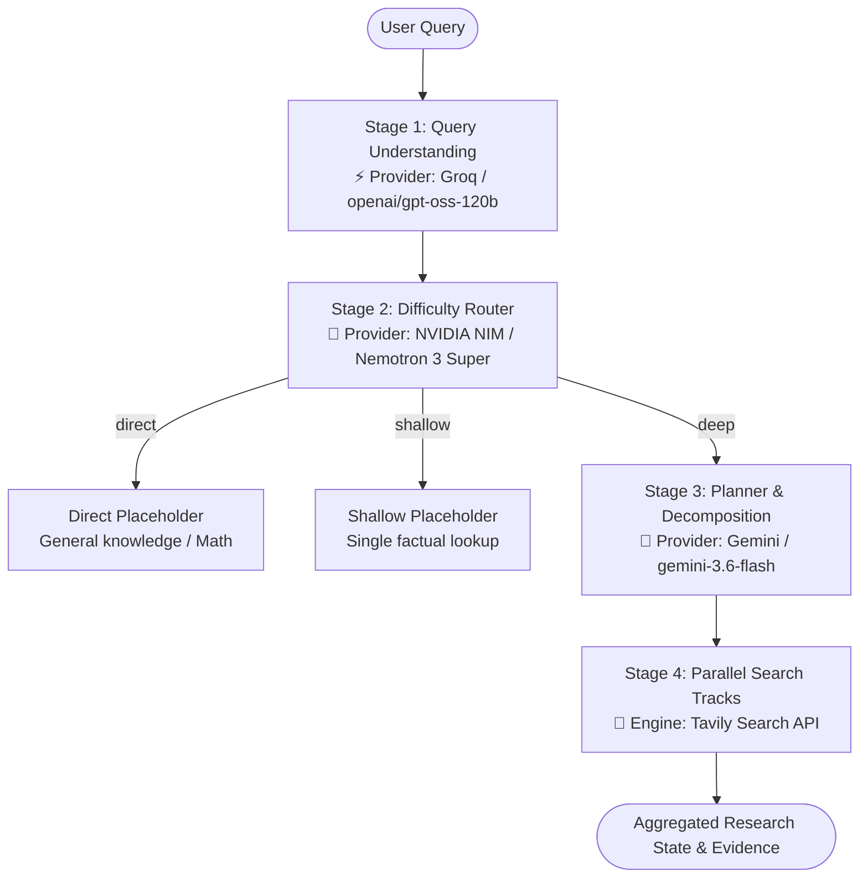

# Deep Research Agent 🚀

A robust, multi-stage agentic research pipeline built with **LangGraph** and an intelligent **multi-provider LLM abstraction layer**. The pipeline dynamically analyzes research queries, routes by difficulty, decomposes complex topics into parallel research tracks, and retrieves grounded evidence from the web.

---

## 🏗️ Architecture & Multi-Provider Strategy

Rather than relying on a single LLM provider and hitting restrictive free-tier rate limits, the pipeline distributes specialized tasks to candidate free-tier providers based on empirical speed, reliability, and structured output support:



| Pipeline Node | Assigned Provider | Pinned Model | Role & Rationale |
|---|---|---|---|
| **Query Understanding** | **Groq** | `openai/gpt-oss-120b` | **Sub-second extraction (0.5s – 0.8s)** of intent, entities, and operational constraints. |
| **Difficulty Router** | **NVIDIA NIM** | `nvidia/nemotron-3-super-120b-a12b` | **Fast routing (1.0s – 2.5s)** into `shallow`, `direct`, or `deep` with reasoning control (`enable_thinking: False`). |
| **Planner & Decomposition** | **Gemini** | `gemini-3.6-flash` | **Deep decomposition (~28s)** into a research strategy with 2–3 independently searchable sub-queries. Gemini quota is preserved only for deep queries. |
| **Parallel Search Tracks** | **Tavily** | Search REST API | **Concurrent web search** and evidence collection across sub-queries. |
| *Reserve Option 1* | *NVIDIA NIM Ultra* | `nvidia/nemotron-3-ultra-550b-a55b` | 550B frontier model with verified structured output support (~45s). |
| *Reserve Option 2* | *OpenRouter* | `nex-agi/nex-n2.5-mini:free` | Free-tier fallback aggregator. |

---

## 📦 Getting Started

### 1. Clone the Repository
```bash
git clone https://github.com/Gayatri-N-Gaikwad/Deep-Research-Agent.git
cd Deep-Research-Agent
```

### 2. Install Dependencies
```bash
pip install -r requirements.txt
```

### 3. Environment Variables
Copy the template `.env.example` to `.env`:
```bash
cp .env.example .env
```

Add your API keys to `.env`:
```env
# Active Providers
GROQ_API_KEY=gsk_...
NVIDIA_API_KEY=nvapi-...
GOOGLE_API_KEY=AIzaSy...
TAVILY_API_KEY=tvly-...

# Optional / Reserve Providers
OPENROUTER_API_KEY=sk-or-...
```

---

## 🚀 Running the Pipeline

Launch the interactive research CLI:
```bash
python main.py
```

### Example Queries
- **Deep Research Query (Full Pipeline):**
  ```text
  Compare the economic policies of the United States and Japan
  ```
- **Direct Query (No search required):**
  ```text
  What is 15 times 12?
  ```
- **Shallow Lookup Query (Single targeted search):**
  ```text
  What is the capital of France?
  ```

---

## 🧪 Testing

### Fast Offline Unit Tests (Mocked LLM, Zero API Quota)
Runs 26 unit tests covering state validation, conditional graph routing, concurrent retrieval, and retry handling:
```bash
pytest -m "not integration" -v
```

### Live Integration Tests (Real API Calls)
Executes end-to-end node integration calls across Groq, NVIDIA NIM, and Gemini:
```bash
pytest -m integration -v --durations=0
```

---

## 🔍 Structured-Output Compatibility Probe

A diagnostic CLI tool is included to test structured output across any candidate provider against all Pydantic schemas in the pipeline:
```bash
# Run probe across all active providers
python scripts/probe_structured_output.py

# Probe specific providers
python scripts/probe_structured_output.py --providers groq nvidia_nim

# Inspect validated Pydantic JSON payloads
python scripts/probe_structured_output.py --providers groq --show-payloads
```

---

## 📁 Repository Structure

```text
Deep-Research-Agent/
├── main.py                         # Top-level CLI entry point
├── pytest.ini                      # Pytest marker configuration
├── requirements.txt                # Pinned dependency versions
├── .env.example                    # Environment variable template
├── .gitignore                      # Safe Git exclusions (.env, caches, logs)
├── nodes/
│   └── llm_providers.py            # Compatibility shim for provider abstraction
├── research_agent/
│   ├── graph.py                    # LangGraph StateGraph builder & routing logic
│   ├── state.py                    # TypedDict ResearchState schema
│   ├── main.py                     # CLI implementation and pretty-printer
│   ├── nodes/
│   │   ├── llm_providers.py        # Multi-provider LLM registry & factory
│   │   ├── query_understanding.py  # Stage 1: Intent & entity extraction (Groq)
│   │   ├── difficulty_router.py    # Stage 2: Complexity routing (NVIDIA NIM)
│   │   ├── planner.py              # Stage 3: Query decomposition (Gemini)
│   │   ├── search_tracks.py        # Stage 4: Concurrent Tavily search tracks
│   │   └── placeholders.py         # Direct/Shallow path handlers
│   └── tests/
│       ├── test_graph_routing.py   # State graph edge routing unit tests
│       ├── test_query_understanding.py
│       ├── test_difficulty_router.py
│       ├── test_planner.py
│       ├── test_search_tracks.py
│       └── test_live_integration.py# Live multi-provider integration tests
└── scripts/
    └── probe_structured_output.py  # Diagnostic compatibility probe tool
```
